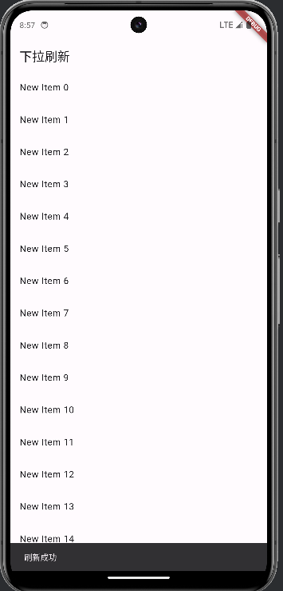

# flutter—customize

用flutter实现一些自定义的组件（更新中）

#已实现的组件
| CustomizeWidget                            | Description                                                  |
| ------------------------------------------ | ------------------------------------------------------------ |
| DraggableScrollbar                         | 基于当下流行app（微信）实现的可拖动的滚动条                   |
| ImageCarousel                              | 图片轮播                                                     |
| RefreshPage                                | 下拉刷新                                                     |
| RefreshAndLoadmore                         | 底部上拉加载更多                                             |
| PageTransition                             | 页面滑动效果（包含滑动过度、淡入淡出过渡、缩放过渡 ）         |

#组件运行的截图

微信同款滚动条

图片轮播（gif太大，用图片替换(ノ｀Д)ノ）

下拉刷新（下拉页面顶部会有圆圈提醒进度）

上拉加载更多

